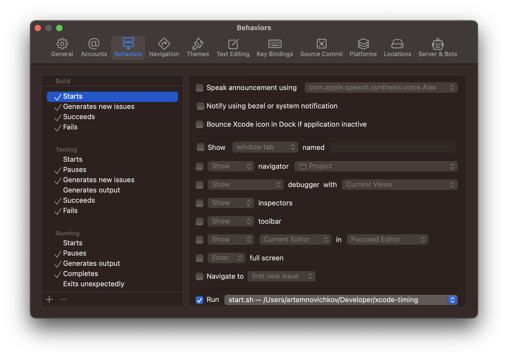
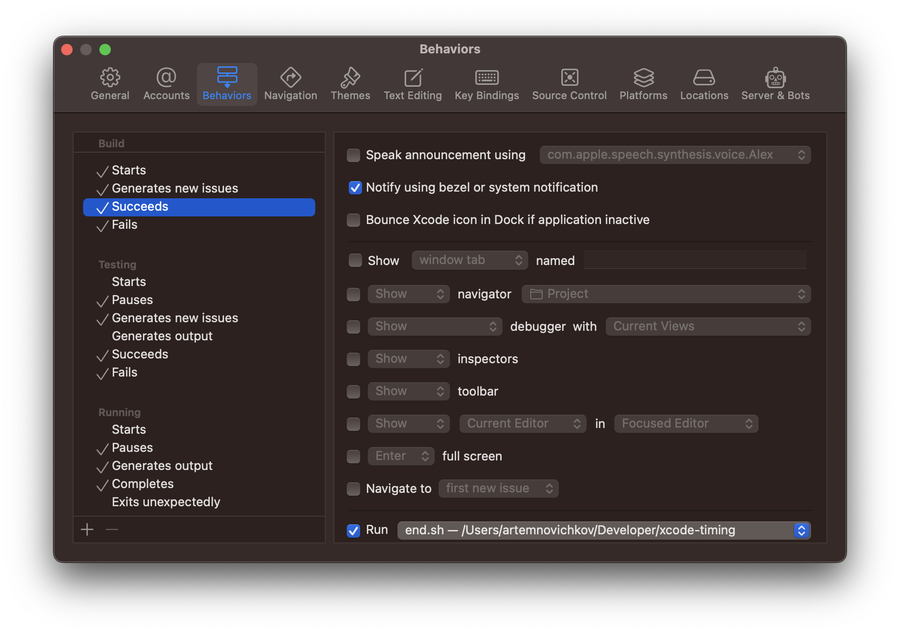
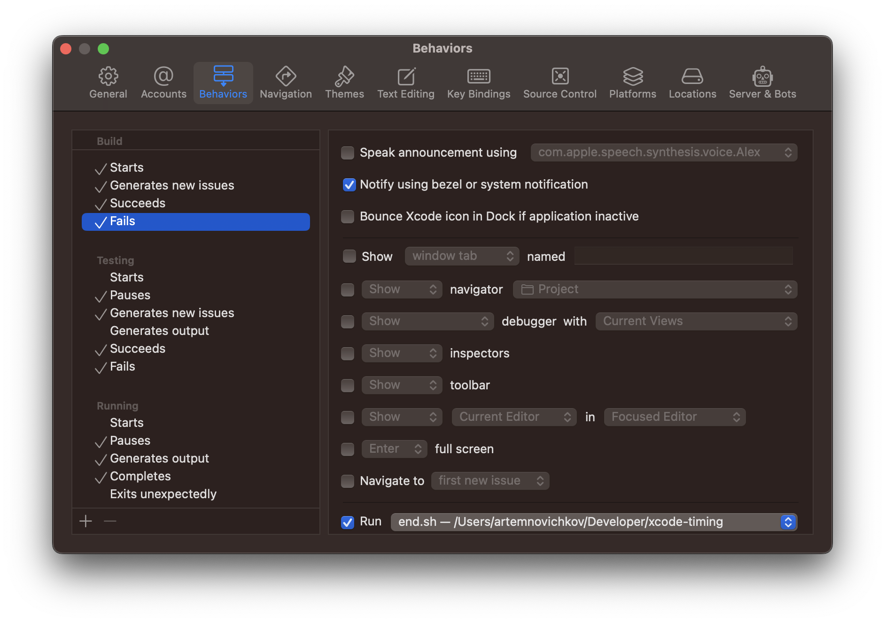

# xcode-timing

A CLI tool for collecting Xcode build statistics.

## Installation

1. Clone the repo.
2. Install the tool:

```bash
$ make install
```
3. Edit behaviors via Xcode -> Behaviors -> Edit Behaviors...

- Add start.sh script to Starts


- Add end.sh script to Succeeds and Fails



## Usage

By default, all statistics are saved in Documents/xcode-times.json.

```json
[
  {
    "totalBuilds" : 64,
    "project" : "MyProject.xcworkspace",
    "totalBuildTime" : 1825.0506573915482,
    "lastStartDate" : 676459449.23457396,
    "date" : 676380482.42901003
  }
]
```

You can run `xcode-timing show` to see all statistics:

```bash
+------------+-----------------------+------------------+--------------------+
| Date       | Project Name          | Total Build Time | Average Build Time |
+------------+-----------------------+------------------+--------------------+
| 08.06.2022 | MyProject.xcworkspace | 30m 25s          | 28s                |
| 09.06.2022 | MyProject.xcworkspace | 21m 45s          | 37s                |
+------------+-----------------------+------------------+--------------------+
```

Or you can use `xcode-timing show -n MyProject.xcworkspace` to see statistics for selected project:

```bash
+------------------------------------------------------+
| Build statistics for MyProject.xcworkspace (08.06.2022-09.06.2022) |
+------------------------------------------------------+
| Total Builds | Total Build Time | Average Build Time |
+--------------+------------------+--------------------+
| 99           | 52m 10s          | 31s                |
+--------------+------------------+--------------------+
```
